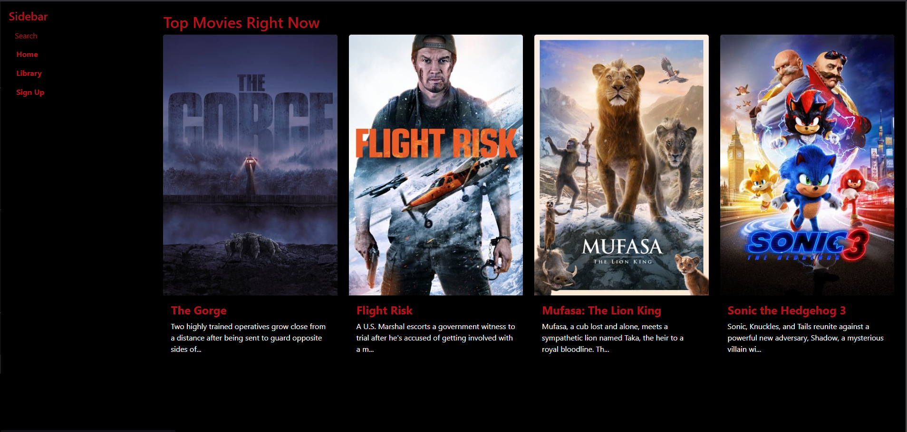
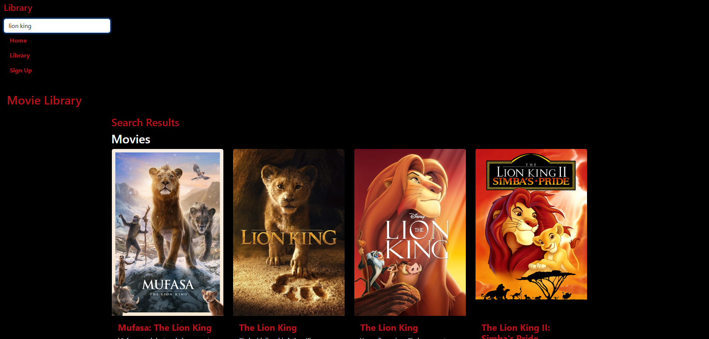
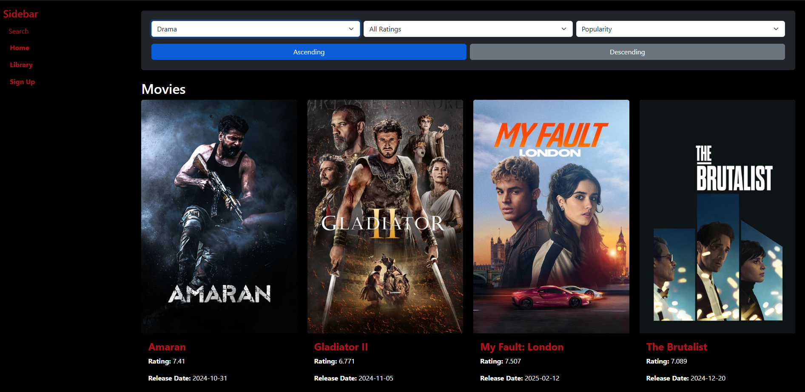

🎬 About the Project

This project is a dynamic movie filtering and details page that interacts with The Movie Database (TMDB) API. Users can:

Filter movies by genre and rating.

Sort movies by title, release date, rating, or popularity.

View detailed information about selected movies.

🚀 Features

Fetch movies dynamically from the TMDB API.

Sorting & Filtering: Real-time movie filtering based on user input.

Movie Details Page: Displays additional information, including cast and overview.

Responsive UI: Optimized for desktop and mobile devices.

🛠️ Tech Stack

Frontend: HTML, CSS (Bootstrap), JavaScript

API: TMDB API

Libraries Used: Bootstrap for styling, Fetch API for API requests

🤖 AI Contributions

Code Optimization: AI helped restructure code for better efficiency and maintainability.

DRY Principle: Refactored repeated code blocks into reusable functions.

Debugging: Identified and resolved API response structure issues.

🔧 Installation

Clone the repository:

git clone [https://github.com/yourusername/tmdb-movie-filter.git](https://github.com/loay-adel/movie.git)

Navigate to the project folder:

cd tmdb-movie-filter

Open index.html in a browser.

🌍 Live Demo

Live Project Link [(Live)](https://movie-git-main-loays-projects-a61d755c.vercel.app)

🤝 Contributing

Feel free to open issues or submit pull requests to improve the project.

📩 Connect with Me

LinkedIn: https://www.linkedin.com/in/loay-adel/

GitHub: [Your GitHub](https://github.com/loay-adel)
